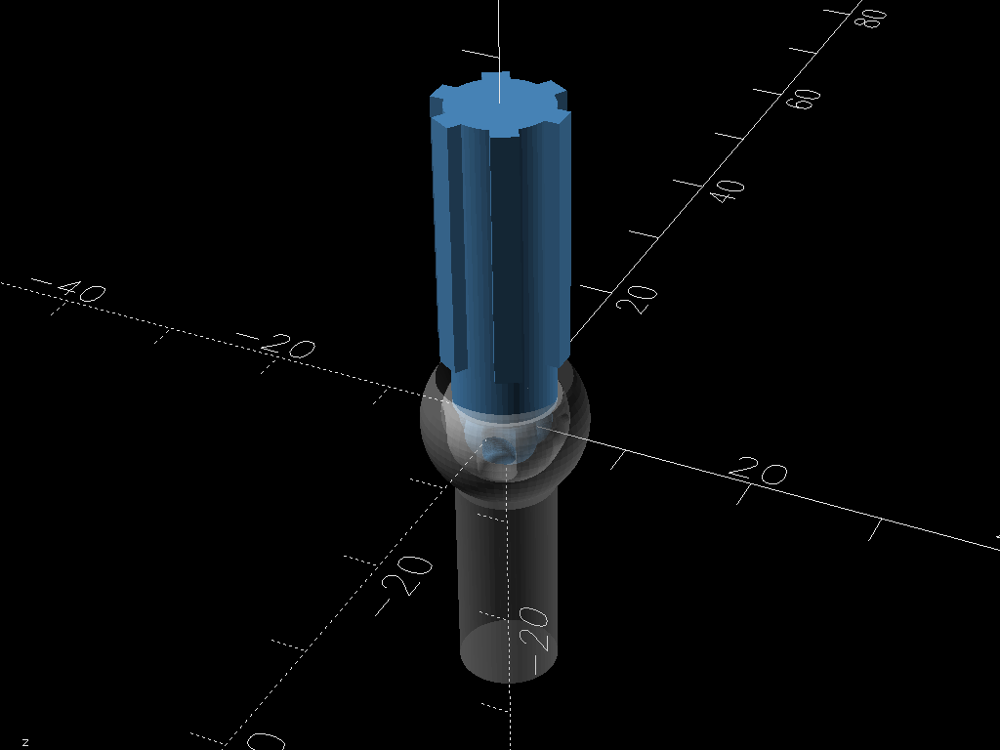

# An OpenSCAD Model for a Rzeppa Joint

This is the [constant velocity (CV) joint](https://en.wikipedia.org/wiki/Constant-velocity_joint) for front wheel drive vehicles.

This implementation allows us to use 3mm, 4mm, and 6mm steel ball bearings as well as to parameterize the number of balls.

As of 2026-02 we are able to use 5x 3mm balls to create a functional joint that is of a size that might be practical to use in a custom RC platform.

This is a stand-alone model for demonstration and learning and tuning.
