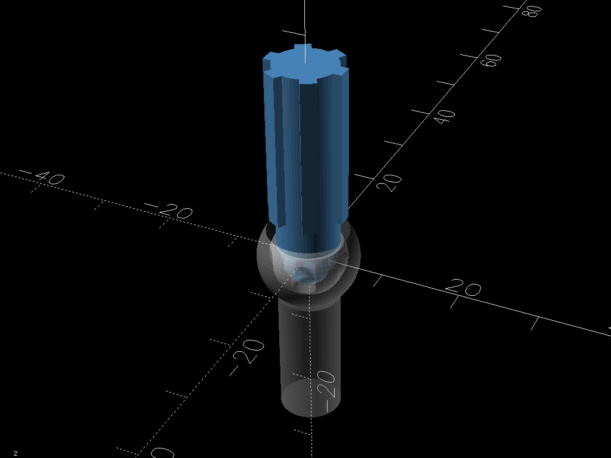

# A FreeCAD and OpenSCAD Model for a Rzeppa Joint

This is a stand-alone model for demonstration and learning and tuning of a [constant velocity (CV) joint](https://en.wikipedia.org/wiki/Constant-velocity_joint) for front wheel drive vehicles.

The intent here is to design a drive train that is possible to 3D print in a size that is practical for use in a custom RC platform.

## OpenSCAD

This implementation allows us to use 3 mm, 4 mm, and 6 mm steel ball bearings as well as to parameterize the number of balls.

As of 2026-02 we are able to use 5x 3 mm balls to create a functional joint.

I started off using OpenSCAD and Gemini to help me figure out the mechanics and then iterating to get a functional print.

As of 2026-03 we have been successful with using the FreeCAD model to print a functional joint using 2.5 mm balls.

But I soon discovered I hit a wall trying to design the entire drive train.
OpenSCAD seems to be really good for creating a single part, but it is lacking in the 'assembly' workflow to have several parts come together.
I found the single coordinate system to be a blocker when trying to design the C hub.
So I opted to stop and start working to port this into FreeCAD

## FreeCAD

This implementation is the current design. I transposed the design I created in OpenSCAD to FreeCAD.
This was a significant learning exercise and this model is likely not really good still.

As of 2026-03 I have been able to create a functional print using 2.5 mm steel balls.
